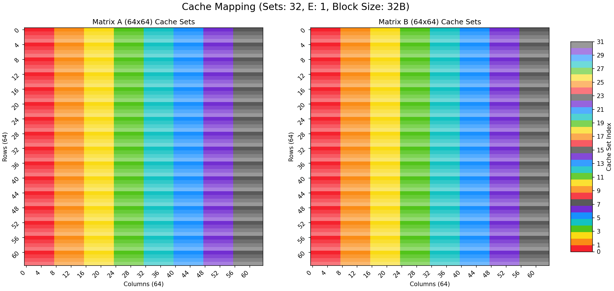

# Cachelab 可视化脚本
这个仓库包含两个Python脚本，用于帮助理解和可视化缓存内存的行为：`cache_range.py` 和 `sim2.py`。

图例：



## 1. `cache_range.py`

### 目的

`cache_range.py` 脚本用于可视化两个矩阵（A 和 B）的内存地址如何映射到缓存组。它通过为每个矩阵元素分配一个颜色来表示其所属的缓存组，从而帮助用户直观地理解缓存组的分布。

### 特性

- **双矩阵可视化：** 同时绘制矩阵 A（N×M）和矩阵 B（M×N）的缓存组映射。
- **可配置参数：** 支持自定义缓存参数（组数 S、关联度 E、块大小 B）以及矩阵的维度 N 和 M。
- **地址偏移：** 允许为矩阵 B 指定一个起始地址偏移量，以模拟不同的内存布局。
- **独特配色方案：** 采用精心设计的64种颜色（8个色系，每个色系8个渐变梯度），确保相邻缓存组使用不同色系的颜色，提高视觉区分度。
- **错误检查：** 对输入的缓存组数进行校验，确保在颜色支持范围内。

### 使用方法

运行脚本时，需要提供缓存参数和矩阵维度。

**基本语法：**

```
python cache_range.py <s> <E> <b> <N> <M> [可选参数]
```

**参数说明：**

- `<s>`: `log2(S)`，其中 `S` 是缓存组的数量（例如，`3` 表示 S=8 个组）。
- `<E>`: 缓存关联度 `E`（例如，`1` 表示直接映射，`4` 表示4路组相联）。
- `<b>`: `log2(B)`，其中 `B` 是缓存块大小（字节）（例如，`4` 表示 B=16 字节）。
- `<N>`: 矩阵 A 的行数（也是矩阵 B 的列数）。
- `<M>`: 矩阵 A 的列数（也是矩阵 B 的行数）。

**可选参数：**

- `--offset <HEX_ADDRESS>`: 矩阵 B 的起始地址偏移量（十六进制字符串，例如 `'0x40000'`）。默认值为 `0x40000`。
- `--element_size <BYTES>`: 每个矩阵元素的大小（字节）。默认值为 `4`（表示 `int` 类型）。

**示例：**

```
# 默认参数运行，矩阵A和B大小为32x32，偏移量0x40000，元素大小4字节
python cache_range.py 5 1 5 32 32

# 指定偏移量和元素大小
python cache_range.py 5 1 5 32 32 --offset 0x40000 --element_size 4

# 矩阵大小为64x64
python cache_range.py 5 1 5 64 64 --offset 0x40000 --element_size 4

# 矩阵N和M不相等的情况
python cache_range.py 5 1 5 61 67 --offset 0x40000 --element_size 4
```

## 2. `sim2.py`

### 目的

`sim2.py` 脚本用于可视化 `cachelab` 跟踪文件（`.trace`）中记录的缓存访问模式。它能够实时显示矩阵元素是缓存命中（绿色）还是缓存未命中（白色），并高亮显示当前正在访问的元素。

### 特性

- **实时可视化：** 动态更新矩阵以显示缓存命中/未命中情况。
- **颜色编码：** 缓存命中显示为绿色，缓存未命中显示为白色，当前访问的元素高亮显示为蓝色。
- **暂停/继续控制：** 在显示窗口中按 `p` 键可以暂停或继续动画，按 `ESC` 键退出。
- **图像保存：** 可以将每一帧保存为图像文件，用于生成视频或详细分析。
- **自动基地址解析：** 自动从跟踪文件中解析矩阵 A 和 B 的基地址。

### 前提条件

`sim2.py` 需要 `cachelab` 的 `test-trans` 和 `csim-ref` 程序来生成 `.trace` 文件。

**生成 `.trace` 文件示例：**

```
# 使用 test-trans 生成转置操作的 trace 文件
./test-trans -M 32 -N 32

# 使用 csim-ref 模拟缓存行为并生成详细的 trace 输出
# -s 5: log2(S) = 5 (32个组)
# -E 1: E = 1 (直接映射)
# -b 5: log2(B) = 5 (32字节块大小)
# -t ./trace.fi: 输入 trace 文件
./csim-ref -v -s 5 -E 1 -b 5 -t ./trace.fi > ./32x32.trace
```

### 使用方法

运行脚本时，需要指定矩阵的行数、列数和跟踪文件路径。

**基本语法：**

```
python3 sim2.py -r <ROWS> -c <COLS> -f <FILE_PATH> [可选参数]
```

**参数说明：**

- `-r`/`--rows <ROWS>`: 矩阵的行数。
- `-c`/`--cols <COLS>`: 矩阵的列数。
- `-f`/`--file-path <FILE_PATH>`: 跟踪文件（`.trace`）的路径。

**可选参数：**

- `-S`/`--save-images`: 保存每一帧图像到磁盘（默认不保存）。图像将保存到 `/tmp/<ROWS>x<COLS>-cache_footprint-<trace_filename>` 目录下。
- `-n`/`--no-display`: 关闭实时显示窗口（默认显示）。
- `-F`/`--fast`: 快速模式，禁用暂停控制，动画会连续播放（默认启用暂停控制）。

**示例：**

```
# 运行可视化，矩阵大小为32x32，使用32x32.trace文件
python3 sim2.py -r 32 -c 32 -f ./32x32.trace

# 运行并保存图像
python3 sim2.py -r 32 -c 32 -f ./32x32.trace -S

# 运行但不显示窗口（仅保存图像）
python3 sim2.py -r 32 -c 32 -f ./32x32.trace -n

# 快速模式运行
python3 sim2.py -r 32 -c 32 -f ./32x32.trace -F
```

**注意：**

- 目前 `sim2.py` 暂不支持非正方形矩阵。
- `trace` 文件格式与 `csim-ref` 的输出格式耦合，脚本会跳过开头的4行和末尾的2行。
